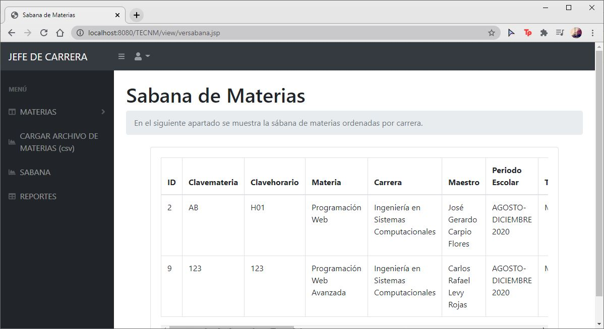

# SistemaTECNM
El siguiente sistema se elaboro para la materia de Programación Web Avanzada del Instituto Tecnológico de León, el cual consiste en un Gestor de Horarios. Se puede acceder al sistema al ejecutarlo utilizando tres tipos de usuarios distintos: Administrador, Jefe de carrera o Maestro.
El sistema se desarrollo utilizando el patrón de diseño Modelo-Vista-Controlador (MVC).

## DEMO
# ~~~~~ Inicio de Sesión ~~~~~


# ~~~~~ Administrador ~~~~~
---Dashboard---


---Registrar Nueva Carrera---


---Consulta, Edición y Eliminación de Carrera---


---Asignación de Jefe de Carrera---


---Asignación de Maestro por Carrera---


# ~~~~~ Jefe de carrera ~~~~~
---Dashboard---


---Registrar Nueva Materia---


--Consulta, Edición y Eliminación de Materia---


---Sabana de Materias---



---Reportes de Maestros por Carrera


--Alta de materias por archivo CSV---


# ~~~~~ Maestro ~~~~~

---Visualización de su reporte---


## HERRAMIENTAS PARA EJECUTAR EL SISTEMA

- Para la creación de este proyecto se utilizo el IDE Eclipse
- Se utilizo XAMPP para ejecutar el servidor MySQL para la base de datos

  (La base de datos debe de crearse en localhost/phpmyadmin)
- Se utilizó como servidor web Apache Tomcat (previamente instalado en el IDE)

## ¿DESEAS CLONAR EL PROYECTO?
- Puedes descarga el archivo .zip y descomprimir la carpeta en la ubicación que tu desees.
- Si deseas utilizar la url:
  1. Abre la terminal (se recominda git)
  2. Coloca la ruta donde deseas almacenar el proyecto
  3. Utiliza el siguiente comando: **git clone https://github.com/MitziAiled/SistemaTECNM.git**
  
¡FÁCIL Y SENCILLO PUEDES TENER EL PROYECTO EN TU COMPUTADOR!
  
## EJECUCIÓN DEL SISTEMA
1. Abre el IDE Eclipse
2. Verifica que tienes instalado el servidor Apache Tomcat
3. Enciende los servicios de MySQL de XAMPP (ya debes de tener la base de datos creada donde se menciono con anterioridad)
4. Ubica el archivo **login.jsp** que se encuentra dentro del proyecto
5. Da click derecho sobre el archivo mencionado y seleccion **Run As** y a continuación **Run on Server**
6. Elige el Servidor de Tomcat
7. ¡Visualiza el proyecto ejecutandose!

## USUARIOS Y CONTRASEÑAS
Para ingresar al sistema con los diferentes tipos de usuario se necesitan los siguientes usuarios y contraseñas:

```
PARA ADMINISTRADOR
usuario: admin
contraseña: 120997
```
```
PARA UN JEFE DE CARRERA
usuario: aguila
contraseña: 12345
```
```
PARA UN MAESTRO
usuario: levy
contraseña: 123
```
NOTA:
En el script de la base de datos se puede visualizar las inserciones que se deben hacer y muestra los usuarios y las contraseñas de los 3 tipos de usuarios.

## ARCHIVOS DEL PROYECTO


